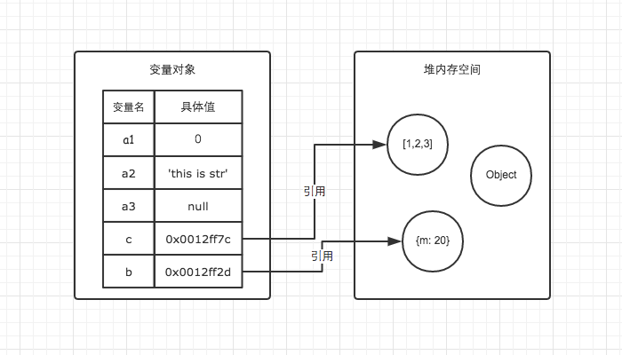
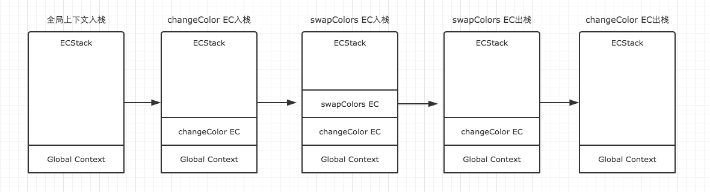
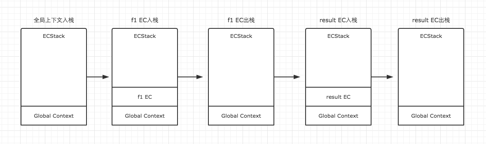

### 前端进阶系列
#### (一)内存空间详细图解

变量对象与堆内存

    var a = 20;
    var b = 'abc';
    var c = true;
    var d = { m: 20 }
因为JavaScript具有自动垃圾回收机制，所以对于前端开发来说，内存空间并不是一个经常被提及的概念，很容易被大家忽视。特别是很多不是计算机专业的朋友在进入到前端之后，会对内存空间的认知比较模糊，甚至有些人干脆就是一无所知。

当然也包括我自己。在很长一段时间里认为内存空间的概念在JS的学习中并不是那么重要。可是后我当我回过头来重新整理JS基础时，发现由于对它们的模糊认知，导致了很多东西我都理解得并不明白。比如最基本的引用数据类型和引用传递到底是怎么回事儿？比如浅复制与深复制有什么不同？还有闭包，原型等等。

因此后来我才渐渐明白，想要对JS的理解更加深刻，就必须对内存空间有一个清晰的认知。
一、栈与堆

    注：栈，也可以叫堆栈

与C/C++不同，JavaScript中并没有严格意义上区分栈内存与堆内存。因此我们可以粗浅的理解为JavaScript的所有数据都保存在堆内存中。但是在某些场景，我们仍然需要基于堆栈数据结构的思路进行处理，比如JavaScript的执行上下文（关于执行上下文我会在下一篇文章中总结）。执行上下文在逻辑上实现了堆栈。因此理解堆栈数据结构的原理与特点任然十分重要。

要简单理解栈的存取方式，我们可以通过类比乒乓球盒子来分析。如下图左侧。

乒乓球盒子与栈类比

这种乒乓球的存放方式与栈中存取数据的方式如出一辙。处于盒子中最顶层的乒乓球5，它一定是最后被放进去，但可以最先被使用。而我们想要使用底层的乒乓球1，就必须将上面的4个乒乓球取出来，让乒乓球1处于盒子顶层。这就是栈空间先进后出，后进先出的特点。图中已经详细的表明了栈空间的存储原理。

堆存取数据的方式，则与书架与书非常相似。

书虽然也整齐的存放在书架上，但是我们只要知道书的名字，我们就可以很方便的取出我们想要的书，而不用像从乒乓球盒子里取乒乓一样，非得将上面的所有乒乓球拿出来才能取到中间的某一个乒乓球。好比在JSON格式的数据中，我们存储的key-value是可以无序的，因为顺序的不同并不影响我们的使用，我们只需要关心书的名字。
二、变量对象与基础数据类型

JavaScript的执行上下文生成之后，会创建一个叫做变量对象的特殊对象（具体会在下一篇文章与执行上下文一起总结），JavaScript的基础数据类型往往都会保存在变量对象中。

    严格意义上来说，变量对象也是存放于堆内存中，但是由于变量对象的特殊职能，我们在理解时仍然需要将其于堆内存区分开来。

基础数据类型都是一些简单的数据段，JavaScript中有5中基础数据类型，分别是Undefined、Null、Boolean、Number、String。基础数据类型都是按值访问，因为我们可以直接操作保存在变量中的实际的值。
三、引用数据类型与堆内存

与其他语言不通，JS的引用数据类型，比如数组Array，它们值的大小是不固定的。引用数据类型的值是保存在堆内存中的对象。JavaScript不允许直接访问堆内存中的位置，因此我们不能直接操作对象的堆内存空间。在操作对象时，实际上是在操作对象的引用而不是实际的对象。因此，引用类型的值都是按引用访问的。这里的引用，我们可以粗浅地理解为保存在变量对象中的一个地址，该地址与堆内存的实际值相关联。

为了更好的搞懂变量对象与堆内存，我们可以结合以下例子与图解进行理解。

    var a1 = 0;   // 变量对象
    var a2 = 'this is string'; // 变量对象
    var a3 = null; // 变量对象
 
    var b = { m: 20 }; // 变量b存在于变量对象中，{m: 20} 作为对象存在于堆内存中
    var c = [1, 2, 3]; // 变量c存在于变量对象中，[1, 2, 3] 作为对象存在于堆内存中
    

上例图解

因此当我们要访问堆内存中的引用数据类型时，实际上我们首先是从变量对象中获取了该对象的地址引用（或者地址指针），然后再从堆内存中取得我们需要的数据。

理解了JS的内存空间，我们就可以借助内存空间的特性来验证一下引用类型的一些特点了。

在前端面试中我们常常会遇到这样一个类似的题目

    // demo01.js
    var a = 20;
    var b = a;
    b = 30;
 
    // 这时a的值是多少？
    
    // demo02.js
    var m = { a: 10, b: 20 }
    var n = m;
    n.a = 15;
 
    // 这时m.a的值是多少

在变量对象中的数据发生复制行为时，系统会自动为新的变量分配一个新值。var b = a执行之后，a与b虽然值都等于20，但是他们其实已经是相互独立互不影响的值了。具体如图。所以我们修改了b的值以后，a的值并不会发生变化。

demo01图解

在demo02中，我们通过var n = m执行一次复制引用类型的操作。引用类型的复制同样也会为新的变量自动分配一个新的值保存在变量对象中，但不同的是，这个新的值，仅仅只是引用类型的一个地址指针。当地址指针相同时，尽管他们相互独立，但是在变量对象中访问到的具体对象实际上是同一个。如图所示。

因此当我改变n时，m也发生了变化。这就是引用类型的特性。

demo02图解

通过内存的角度来理解，是不是感觉要轻松很多。除此之外，我们还可以以此为基础，一步一步的理解JavaScript的执行上下文，作用域链，闭包，原型链等重要概念。其他的我会在以后的文章慢慢总结，敬请期待。
内存空间管理

因为JavaScript具有自动垃圾收集机制，所以我们在开发时好像不用关心内存的使用问题，内存的分配与回收都完全实现了自动管理。但是根据我自己的开发经验，了解内存机制有助于自己清晰的认识到自己写的代码在执行过程中发生过什么，从而写出性能更加优秀的代码。因此关心内存是一件非常重要的事情。

JavaScript的内存生命周期

    1.分配你所需要的内存
    2.使用分配到的内存（读、写）
    3.不需要时将其释放、归还
    
为了便于理解，我们使用一个简单的例子来解释这个周期。

    var a = 20;  // 在内存中给数值变量分配空间
    alert(a + 100);  // 使用内存
    a = null; // 使用完毕之后，释放内存空间

第一步和第二步我们都很好理解，JavaScript在定义变量时就完成了内存分配。第三步释放内存空间则是我们需要重点理解的一个点。

JavaScript有自动垃圾收集机制，那么这个自动垃圾收集机制的原理是什么呢？其实很简单，就是找出那些不再继续使用的值，然后释放其占用的内存。垃圾收集器会每隔固定的时间段就执行一次释放操作。

在JavaScript中，最常用的是通过标记清除的算法来找到哪些对象是不再继续使用的，因此a = null其实仅仅只是做了一个释放引用的操作，让 a 原本对应的值失去引用，脱离执行环境，这个值会在下一次垃圾收集器执行操作时被找到并释放。而在适当的时候解除引用，是为页面获得更好性能的一个重要方式。

        在局部作用域中，当函数执行完毕，局部变量也就没有存在的必要了，因此垃圾收集器很容易做出判断并回收。但是全局变量什么时候需要自动释放内存空间则很难判断，因此在我们的开发中，需要尽量避免使用全局变量，以确保性能问题。

#### (二)执行上下文详细图解  
  我们先引入一个JavaScript中最基础，但同时也是最重要的一个概念执行上下文（Execution Context）。  
  每次当控制器转到可执行代码的时候，就会进入一个执行上下文。执行上下文可以理解为当前代码的执行环境，它会形成一个作用域。JavaScript中的运行环境大概包括三种情况。  
  
  * 全局环境：JavaScript代码运行起来会首先进入该环境  
  * 函数环境：当函数被调用执行时，会进入当前函数中执行代码  
  * eval
  
因此在一个JavaScript程序中，必定会产生多个执行上下文，在我的上一篇文章中也有提到，JavaScript引擎会以堆栈的方式来处理它们，这个堆栈，我们称其为函数调用栈(call stack)。栈底永远都是全局上下文，而栈顶就是当前正在执行的上下文。当代码在执行过程中，遇到以上三种情况，都会生成一个执行上下文，放入栈中，而处于栈顶的上下文执行完毕之后，就会自动出栈。  

    var color = 'blue';  
    function changeColor() {
        var anotherColor = 'red';
        function swapColors() {
	    var tempColor = anotherColor;
	    anotherColor = color;
	    color = tempColor;
        }
        swapColors();
    }
    changeColor();

如下图示整段代码的执行过程：  

我们用ECStack来表示处理执行上下文组的堆栈。我们很容易知道，第一步，首先是全局上下文入栈。  
第一步：全局上下文入栈

全局上下文入栈之后，其中的可执行代码开始执行，直到遇到了changeColor()，这一句激活函数changeColor创建它自己的执行上下文，因此第二步就是changeColor的执行上下文入栈。  
第二步：changeColor的执行上下文入栈

changeColor的上下文入栈之后，控制器开始执行其中的可执行代码，遇到swapColors()之后又激活了一个执行上下文。因此第三步是swapColors的执行上下文入栈。
第三步：swapColors的执行上下文入栈

在swapColors的可执行代码中，再没有遇到其他能生成执行上下文的情况，因此这段代码顺利执行完毕，swapColors的上下文从栈中弹出。
第三步：swapColors的执行上下文入栈

在swapColors的可执行代码中，再没有遇到其他能生成执行上下文的情况，因此这段代码顺利执行完毕，swapColors的上下文从栈中弹出。
第五步：changeColor的执行上下文出栈

全局上下文在浏览器窗口关闭后出栈。

    注意：函数中，遇到return能直接终止可执行代码的执行，因此会直接将当前上下文弹出栈。
    
详细了解了这个过程之后，我们就可以对执行上下文总结一些结论了。

    * 单线程
    * 同步执行，只有栈顶的上下文处于执行中，其他上下文需要等待
    * 全局上下文只有唯一的一个，它在浏览器关闭时出栈
    * 函数的执行上下文的个数没有限制
    * 每次某个函数被调用，就会有个新的执行上下文为其创建，即使是调用的自身函数，也是如此。
    
为了巩固一下执行上下文的理解，我们再来绘制一个例子的演变过程，这是一个简单的闭包例子。

    function f1(){
        var n=999;
        function f2(){
          alert(n); 
        }
        return f2;
    }
    var result=f1();
    result(); // 999

因为f1中的函数f2在f1的可执行代码中，并没有被调用执行，因此执行f1时，f2不会创建新的上下文，而直到result执行时，才创建了一个新的。具体演变过程如下。

#### (三)变量对象详解
在JavaScript中，我们肯定不可避免的需要声明变量和函数，可是JS解析器是如何找到这些变量的呢？我们还得对执行上下文有一个进一步的了解。

在上一篇文章中，我们已经知道，当调用一个函数时（激活），一个新的执行上下文就会被创建。而一个执行上下文的生命周期可以分为两个阶段。

    创建阶段
    在这个阶段中，执行上下文会分别创建变量对象，建立作用域链，以及确定this的指向
    代码执行阶段
    创建完成之后，就会开始执行代码，这个时候，会完成变量赋值，函数引用，以及执行其他代码。

执行上下文生命周期

从这里我们就可以看出详细了解执行上下文极为重要，因为其中涉及到了变量对象，作用域链，this等很多人没有怎么弄明白，但是却极为重要的概念，因此它关系到我们能不能真正理解JavaScript。在后面的文章中我们会一一详细总结，这里我们先重点了解变量对象。
变量对象（Variable Object）

变量对象的创建，依次经历了以下几个过程。

    建立arguments对象。检查当前上下文中的参数，建立该对象下的属性与属性值。
    检查当前上下文的函数声明，也就是使用function关键字声明的函数。在变量对象中以函数名建立一个属性，属性值为指向该函数所在内存地址的引用。如果函数名的属性已经存在，那么该属性将会被新的引用所覆盖。
    检查当前上下文中的变量声明，每找到一个变量声明，就在变量对象中以变量名建立一个属性，属性值为undefined。如果该变量名的属性已经存在，为了防止同名的函数被修改为undefined，则会直接跳过，原属性值不会被修改。
    

我知道有的人不喜欢看文字

根据这个规则，理解变量提升就变得十分简单了。在很多文章中虽然提到了变量提升，但是具体是怎么回事还真的很多人都说不出来，以后在面试中用变量对象的创建过程跟面试官解释变量提升，保证瞬间提升逼格。

在上面的规则中我们看出，function声明会比var声明优先级更高一点。为了帮助大家更好的理解变量对象，我们结合一些简单的例子来进行探讨。

    // demo01
    function test() {
       console.log(a);
       console.log(foo());
       var a = 1;
        function foo() {
          return 2;
        }
       }
    test();
    
在上例中，我们直接从test()的执行上下文开始理解。全局作用域中运行test()时，test()的执行上下文开始创建。为了便于理解，我们用如下的形式来表示
    
    创建过程
    testEC = {
        // 变量对象
        VO: {},
        scopeChain: {},
        this: {}
    }
 
    // 因为本文暂时不详细解释作用域链和this，所以把变量对象专门提出来说明
 
    // VO 为 Variable Object的缩写，即变量对象
    VO = {
       arguments: {...},  //注：在浏览器的展示中，函数的参数可能并不是放在arguments对象中，这里为了方便理解，我做了这样的处理
       foo: <foo reference>  // 表示foo的地址引用
       a: undefined
    }
    
未进入执行阶段之前，变量对象中的属性都不能访问！但是进入执行阶段之后，变量对象转变为了活动对象，里面的属性都能被访问了，然后开始进行执行阶段的操作。

    这样，如果再面试的时候被问到变量对象和活动对象有什么区别，就又可以自如的应答了，他们其实都是同一个对象，只是处于执行上下文的不同生命周期。
    
    // 执行阶段
    VO ->  AO   // Active Object
    AO = {
      arguments: {...},
      foo: <foo reference>,
      a: 1
    } 
    
因此，上面的例子demo1，执行顺序就变成了这样

    function test() {
      function foo() {
        return 2;
      }
      var a;
      console.log(a);
      console.log(foo());
      a = 1;
    }
    test();
再来一个例子，巩固一下我们的理解。

    // demo2
    function test() {
    console.log(foo);
    console.log(bar);
 
    var foo = 'Hello';
    console.log(foo);
    var bar = function () {
        return 'world';
    }
 
    function foo() {
        return 'hello';
    }
    }
    test();
    
    // 创建阶段
    VO = {
    arguments: {...},
    foo: <foo reference>,
    bar: undefined
    }
    // 这里有一个需要注意的地方，因为var声明的变量当遇到同名的属性时，会跳过而不会覆盖
    
    // 执行阶段
    VO -> AO
    VO = {
    arguments: {...},
    foo: 'Hello',
    bar: <bar reference>
    }
    
需要结合上面的知识，仔细对比这个例子中变量对象从创建阶段到执行阶段的变化，如果你已经理解了，说明变量对象相关的东西都已经难不倒你了。
全局上下文的变量对象

以浏览器中为例，全局对象为window。
全局上下文有一个特殊的地方，它的变量对象，就是window对象。而这个特殊，在this指向上也同样适用，this也是指向window。

    // 以浏览器中为例，全局对象为window
    // 全局上下文
    windowEC = {
       VO: window,
       scopeChain: {},
       this: window
    }
   
   除此之外，全局上下文的生命周期，与程序的生命周期一致，只要程序运行不结束，比如关掉浏览器窗口，全局上下文就会一直存在。其他所有的上下文环境，都能直接访问全局上下文的属性。
